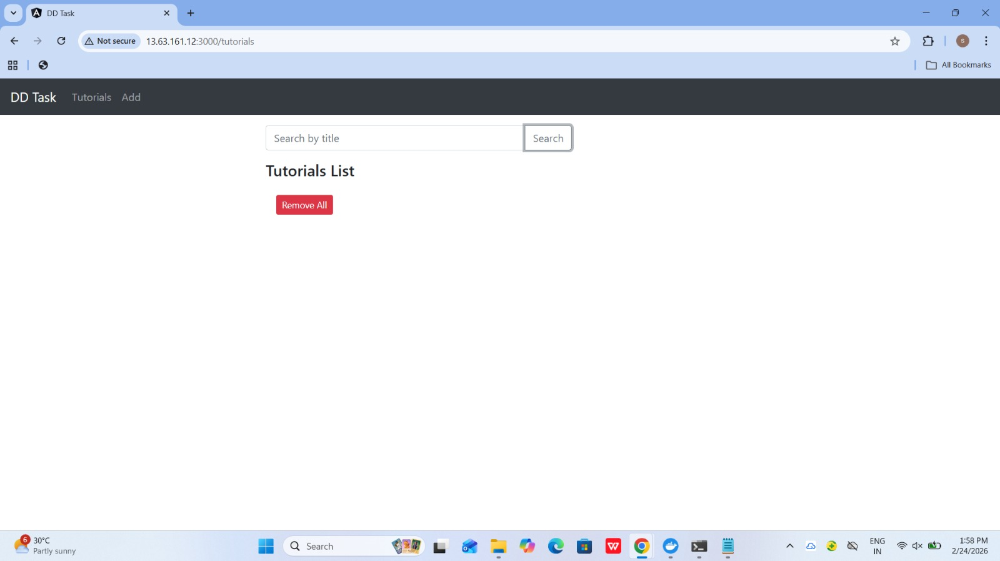
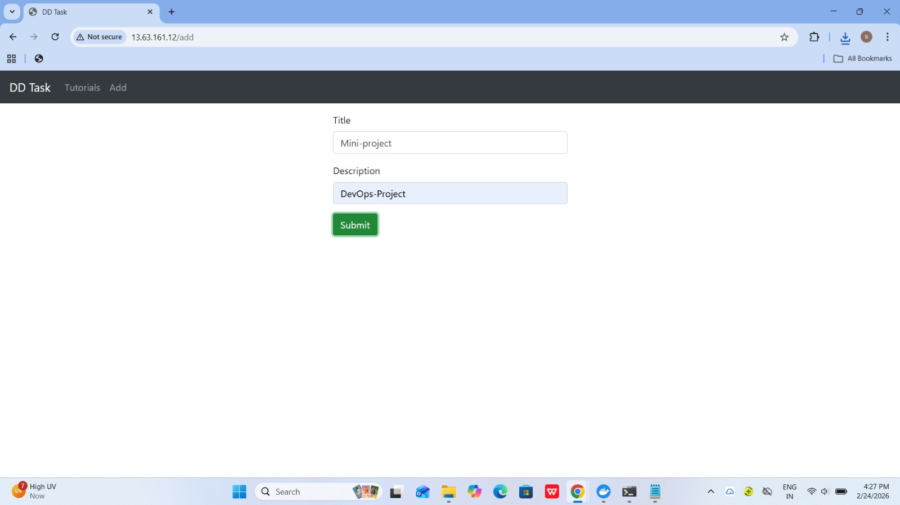
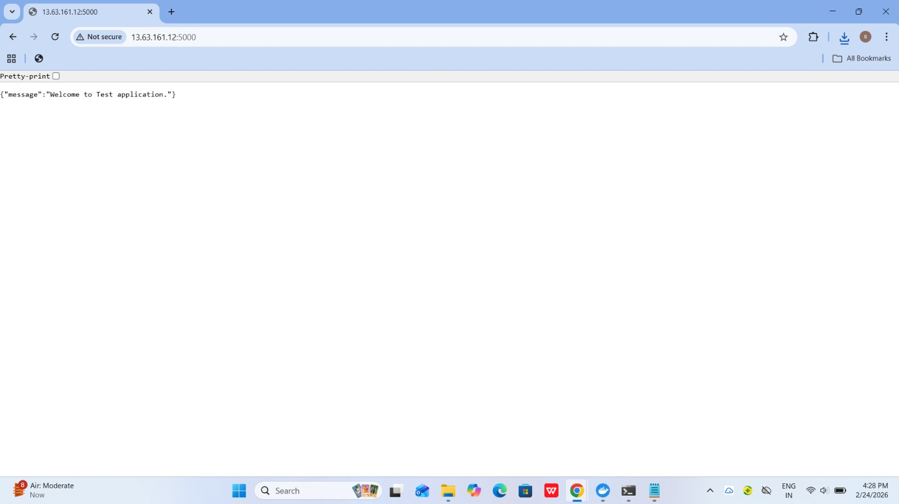
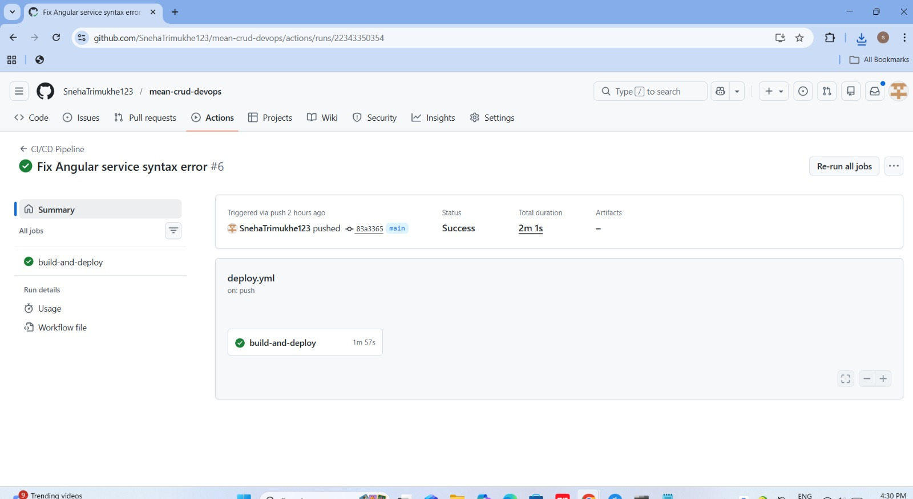
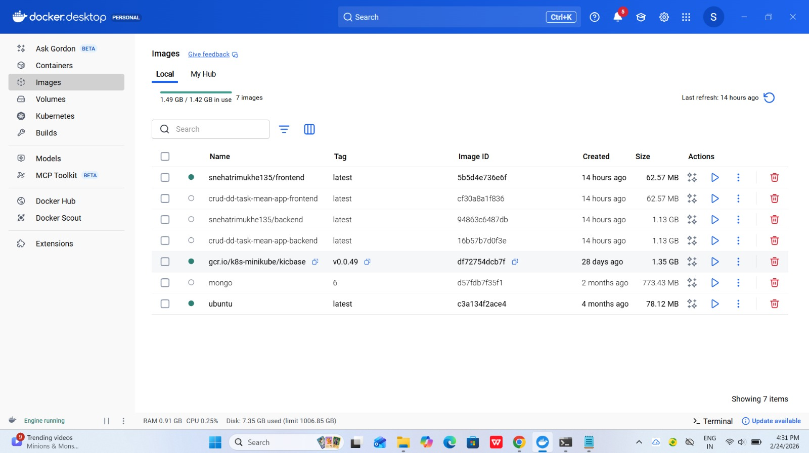

In this DevOps task, you need to build and deploy a full-stack CRUD application using the MEAN stack (MongoDB, Express, Angular 15, and Node.js). The backend will be developed with Node.js and Express to provide REST APIs, connecting to a MongoDB database. The frontend will be an Angular application utilizing HTTPClient for communication.  

The application will manage a collection of tutorials, where each tutorial includes an ID, title, description, and published status. Users will be able to create, retrieve, update, and delete tutorials. Additionally, a search box will allow users to find tutorials by title.

## Project setup

### Node.js Server

cd backend

npm install

You can update the MongoDB credentials by modifying the `db.config.js` file located in `app/config/`.

Run `node server.js`

### Angular Client

cd frontend

npm install

Run `ng serve --port 8081`

You can modify the `src/app/services/tutorial.service.ts` file to adjust how the frontend interacts with the backend.

Navigate to `http://localhost:8081/`

# 🚀 DevOps Implementation & Deployment
---

# 🚀 DevOps Implementation & Deployment

In this project, I have implemented complete DevOps practices to build and deploy the MEAN stack CRUD application on AWS cloud.

---

## 🔹 Application Overview

This is a full-stack CRUD application built using:

- MongoDB (Database)
- Express.js (Backend framework)
- Angular 15 (Frontend)
- Node.js (Runtime)

The application manages tutorials with:

- ID
- Title
- Description
- Published status

Users can:

- Create tutorials
- View all tutorials
- Update tutorials
- Delete tutorials
- Search tutorials by title

---

## 🔹 Docker Implementation

I containerized the application using Docker:

- Created separate Dockerfiles for backend and frontend
- Used MongoDB official image
- Used docker-compose to run all services together

Services:

- frontend
- backend
- mongodb

---

## 🔹 CI/CD Pipeline (GitHub Actions)

I implemented CI/CD using GitHub Actions.

Workflow:

1. When I push code to GitHub (main branch)
2. GitHub Actions builds Docker images
3. Images are pushed to DockerHub
4. GitHub connects to EC2 via SSH
5. Docker containers are updated automatically

This ensures automatic deployment.

---

## 🔹 AWS Deployment

The application is deployed on:

- AWS EC2 (Ubuntu instance)
- Docker installed
- Docker Compose used to manage containers

Public IP:
http://13.63.161.12

## 🔹 Project Architecture

Developer → GitHub → GitHub Actions → DockerHub → AWS EC2 → Docker Containers

# 📸 Screenshots

## 1️⃣ Application Running

---

## 2️⃣ Add Tutorial Working

---

## 3️⃣ Backend API Response

---

## 4️⃣ Docker Containers Running

---

## 5️⃣ CI/CD Pipeline Success

---

## 6️⃣ DockerHub Images

---

# 🎯 Conclusion

I successfully:

- Built full-stack MEAN application
- Dockerized all services
- Created CI/CD pipeline
- Deployed on AWS EC2
- Automated production deployment

This project demonstrates practical DevOps implementation including containerization, CI/CD, and cloud deployment.

